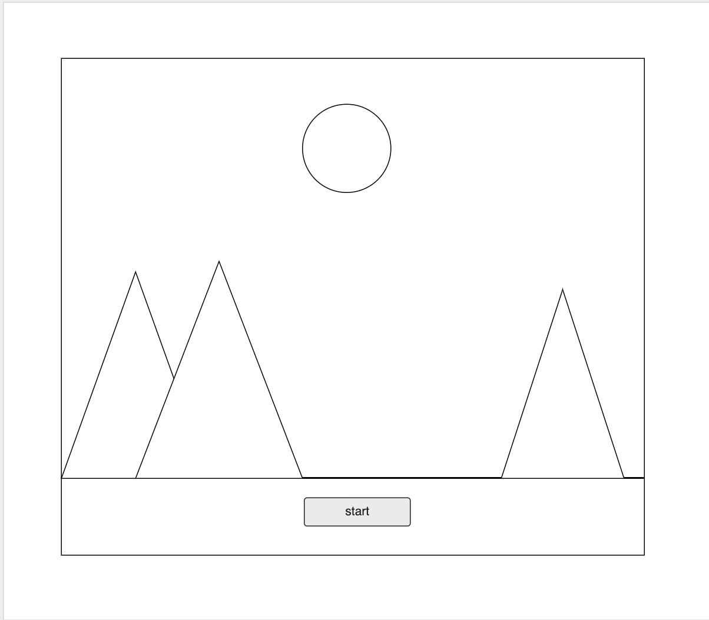
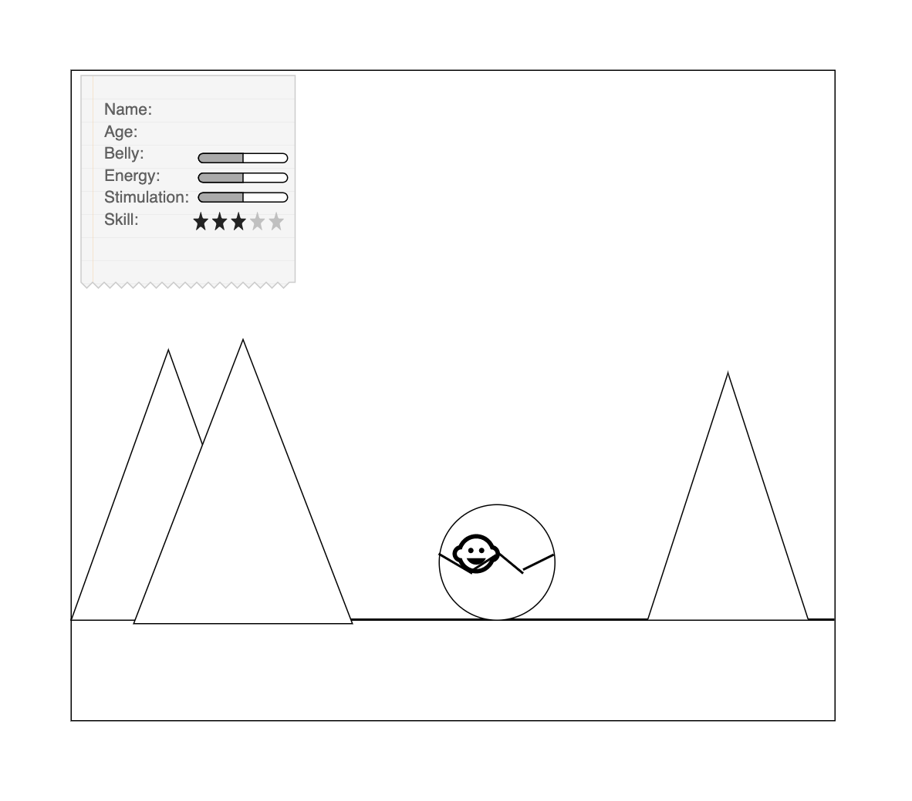
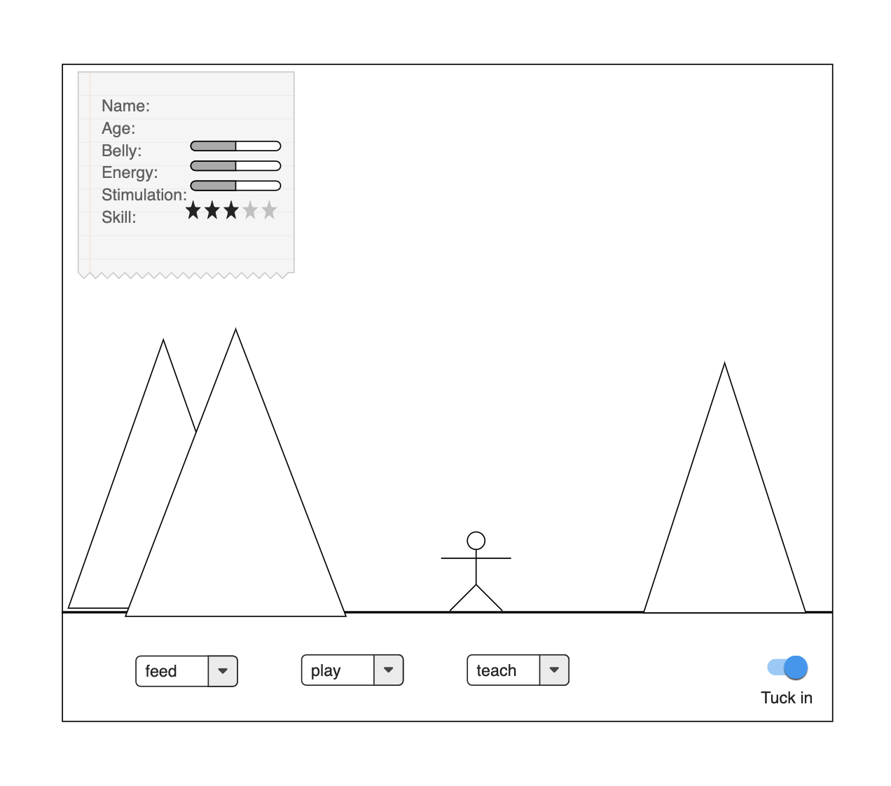
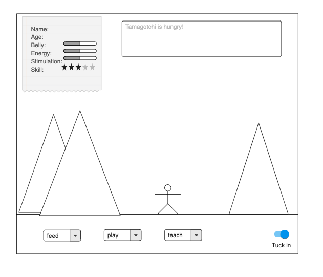

# Project 0 ~~ Tamagotchi

## What & Why

The Tamagotchi project is a beginner's project that demonstrates the creator's ability with HTML, CSS, JavaScript, and DOM manipulation. 

## User Story

- When the user clicks start, the Tamagotchi appears with brief instructions following and an opportunity to change the Tamagotchi's name or stick with the default name.
- The Tamagotchi's stats appear on the screen and increment as time passes. There's no time limit in Tamagotchi world. The Tamagotchi will live as long as the user takes care of it.
- The user can take care of the Tamagotchi by feeding them, playing with them, teaching them, and tucking them in when they're sleepy. 
- If the Tamagotchi is too hungry, sleepy, or bored, they sleep forever and can't wake up.
- The Tamagotchi's age increases by one after a sleep.

## Technologies

For this project, I used HTML, CSS, some Animate CSS classes to help with animations, vanilla Javascript for DOM manipulation. I also used pixilart.com to create my character and object images, loading.io to create a gif image, and audiotrimmer.com to clip out sound snippets. Music from bensound.com and orangefreesounds.com/. Background vector created by freepik - www.freepik.com.

## Approach

Beginning this project, I knew I'd want a class to create the Tamagatchi object as well as a game object to store properties and methods related to game play. I started by plotting out the specific properties and methods that would be tracked by the class and object separately. 

Before writing any JavaScript, I created the base structure I'd want for my main user page. I created the elements I knew I'd need to select from the DOM, and added some styles to put the elements in the correct positions.

With my main elements in place, I created my Tamagotchi class and game object with my planned properties and methods. Then I selected and added functionality to the various buttons and elements on the screen.

After creating the functionality, I then focused on my visuals. I created my images and added keyframes animations to make the character and objects move on click events. I created an image object and helper functions to allow me to switch between images easily.

## Installation Instructions

## Unsolved Problems
Sometimes when the character images pops on screen in place of the moon image, the image shifts a little rather than remaining in place.

## Wireframes

### Start Screen
Tamagotchi is born, and the user is presented with brief instructions.

### Interact With Tamagotchi
The user chooses from interactions options and affects Tamagotchi's stats.

### Tamagotchi Tells How It Feels
Tamagotchi can communicate how they feel through body language and the narrative box. Tamagotchi will live as long as the user takes care of them.

