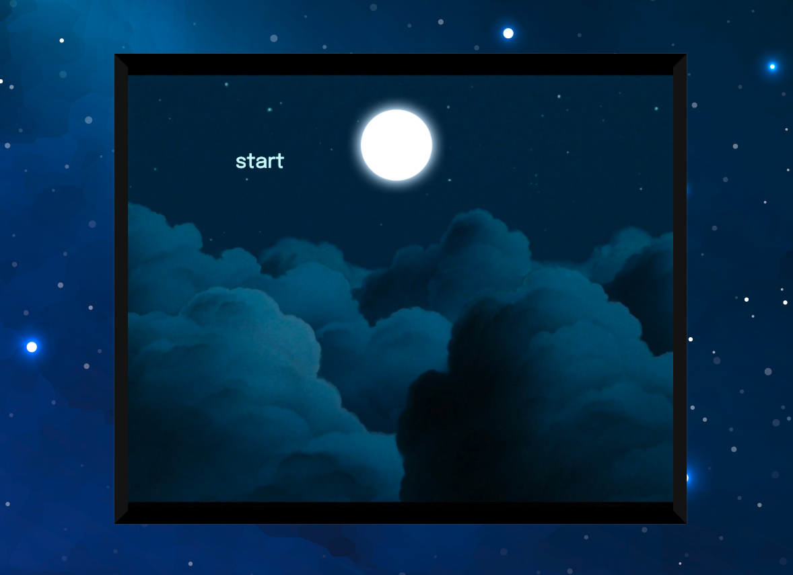
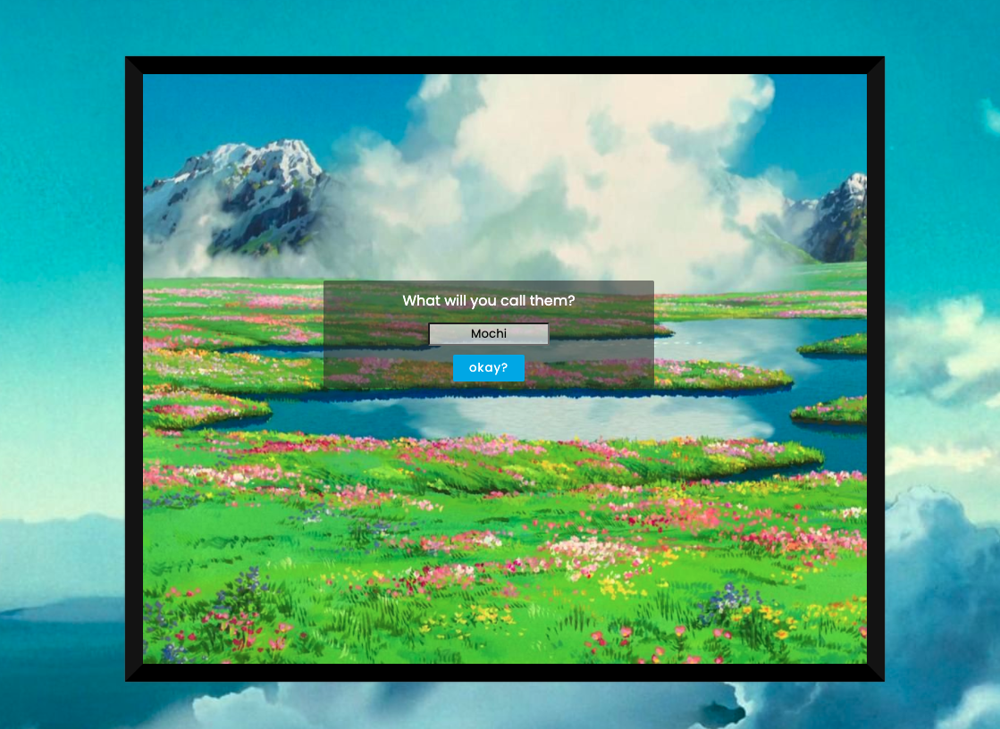
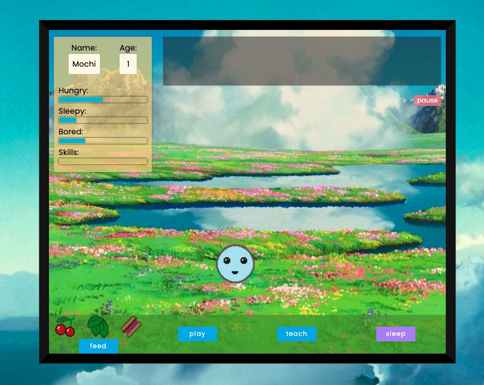
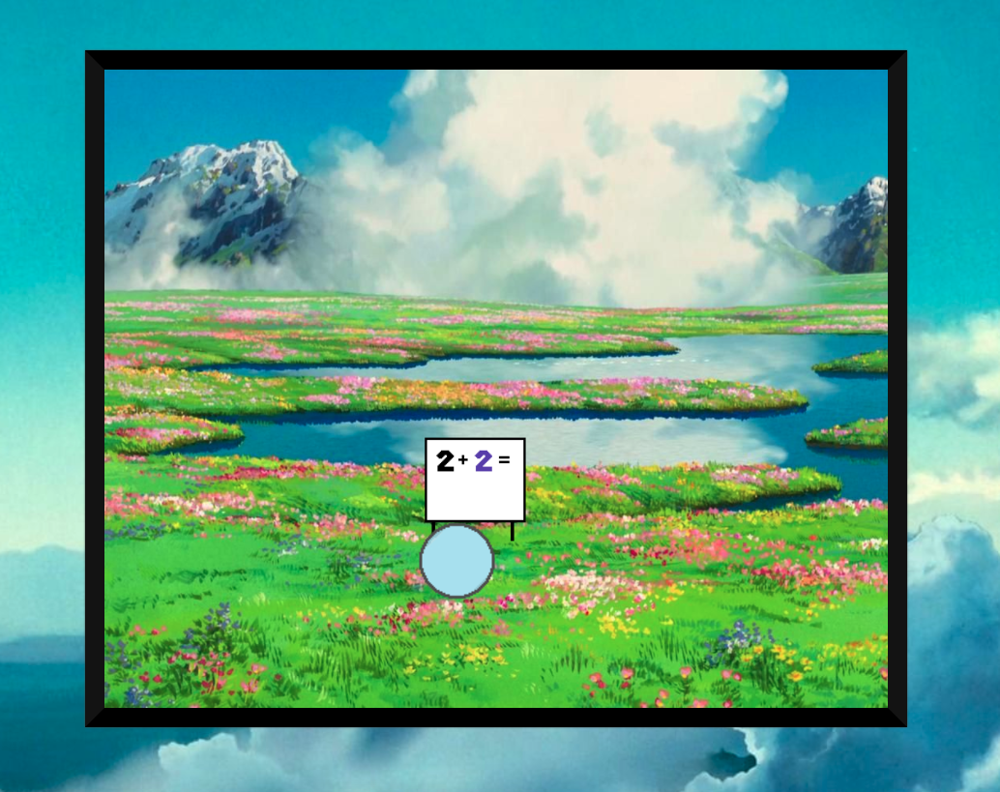
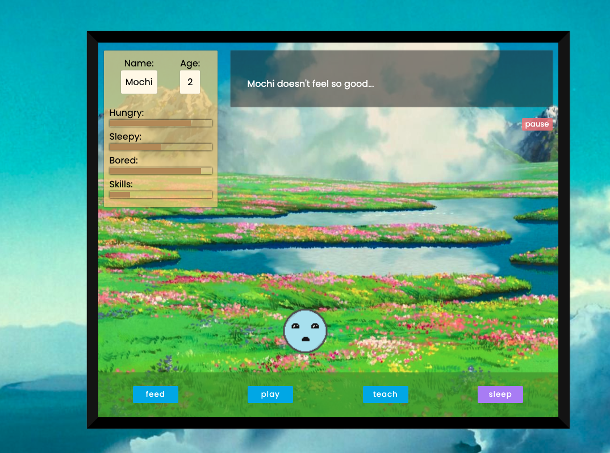
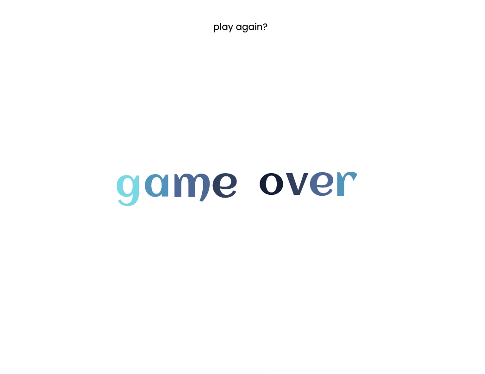

# Tamagotchi

## What & Why

The Tamagotchi project is a simple game that demonstrates skill with HTML, CSS, JavaScript, and DOM manipulation.

## Technologies

- HTML
- CSS
- JavaScript

Resources:

- [pixilart](https://www.pixilart.com) (Used for images and animations)
- [loading.io](https://www.loading.io) (Used to create gif image)
- [audiotrimmer](https://www.audiotrimmer.com) (Used to clip sound snippets)
- [bensound](https://www.bensound.com) (Music)
- [orangefreesounds](http://www.orangefreesounds.com) (Music)
- [freepik](https://www.freepik.com) (Background vector)

## User Story

- When the user clicks start, the Tamagotchi appears with brief instructions following and an opportunity to change the Tamagotchi's name or stick with the default name.
- The Tamagotchi's stats appear on the screen and increment as time passes. There's no time limit in Tamagotchi world. The Tamagotchi will live as long as the user takes care of it.
- The user can take care of the Tamagotchi by feeding them, playing with them, teaching them, and tucking them in when they're sleepy.
- If the Tamagotchi is too hungry, sleepy, or bored, they sleep forever and can't wake up.
- The Tamagotchi's age increases by one after a sleep.

## Wireframes

### Start Screen

Tamagotchi is born, and the user is presented with brief instructions.

### Interact With Tamagotchi

The user chooses from interactions options and affects Tamagotchi's stats.

### Tamagotchi Tells How It Feels

Tamagotchi can communicate how they feel through body language and the narrative box. Tamagotchi will live as long as the user takes care of them.

